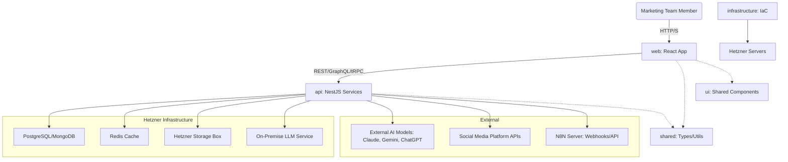

# Components

## Fullstack Application (Main Monorepo Components)

This represents the top-level logical separation within the Nx monorepo.

### web (Frontend Application)

  * **Responsibility:** Provides the user interface for interacting with the content generation, management, and analytics features. Handles all user-facing logic and communication with the backend API.
  * **Key Interfaces:**
      * `UI Components`: Consumes shared UI components and framework-specific components.
      * `API Client`: Interacts with the `api` service via RESTful endpoints.
      * `State Management`: Manages local and global UI state.
  * **Dependencies:** `api` (for data), `shared` (for types, utilities), `ui` (for shared UI components).
  * **Technology Stack:** React, TypeScript, Material-UI/Ant Design, Zustand/React Query, Tailwind CSS.

### api (Backend Application/Services)

  * **Responsibility:** Provides the core business logic, orchestrates content generation, manages data persistence, and exposes RESTful APIs to the `web` frontend and `N8N` integration. Hosts the core on-premise LLM and manages external AI integrations.
  * **Key Interfaces:**
      * `REST API Endpoints`: Exposes endpoints for frontend consumption (e.g., `/companies`, `/writer-profiles`, `/blog-posts`, `/social-posts`, `/analytics`).
      * `Database ORM/Client`: Interacts with PostgreSQL/MongoDB.
      * `LLM Interaction Layer`: Communicates with the `on-premise LLM`.
      * `External AI Clients`: Interacts with Claude, Gemini, ChatGPT APIs.
      * `Social Platform Integrations`: Handles API calls to LinkedIn, Meta, X for publishing and analytics.
  * **Dependencies:** `shared` (for types, utilities), `database`, `on-premise LLM`, `external AI models`, `social platform APIs`, `N8N`.
  * **Technology Stack:** NestJS, TypeScript, PostgreSQL/MongoDB, Redis, various API client libraries.

### shared (Shared Library)

  * **Responsibility:** Contains common code, types, and utilities used by both `web` and `api` applications to ensure consistency and reduce duplication.
  * **Key Interfaces:**
      * `TypeScript Interfaces`: Exported data model interfaces (e.g., `CompanyProfile`, `WriterProfile`).
      * `Utility Functions`: Common helper functions (e.g., date formatting, string manipulation).
      * `Constants`: Shared configuration values.
  * **Dependencies:** None (designed to be a foundational library).
  * **Technology Stack:** TypeScript.

### ui (Shared UI Components - Optional, if custom design system is extensive)

  * **Responsibility:** Houses reusable UI components that can be shared across different frontend applications if the monorepo expands to include more than one frontend (e.g., a separate admin dashboard).
  * **Key Interfaces:** Exported React components.
  * **Dependencies:** `shared`.
  * **Technology Stack:** React, TypeScript, Tailwind CSS, Material-UI/Ant Design (for base components).

### infrastructure (IaC Definitions)

  * **Responsibility:** Manages the provisioning and configuration of server infrastructure on Hetzner using Infrastructure as Code (IaC).
  * **Key Interfaces:** Terraform/Ansible scripts.
  * **Dependencies:** None (manages external resources).
  * **Technology Stack:** Terraform, Ansible.

## Component Interaction Diagram

*Rationale:* This diagram visually represents the logical components and their primary interactions. It clarifies the data flow and how different services within the `api` interact with internal and external dependencies.
