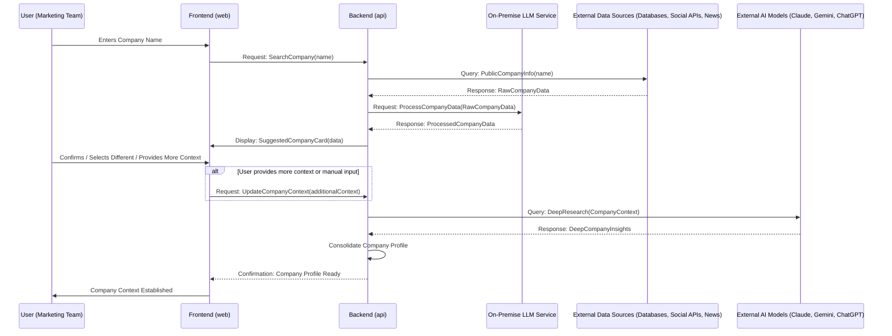
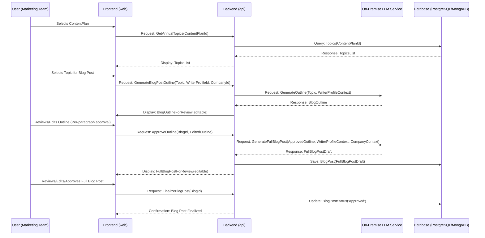
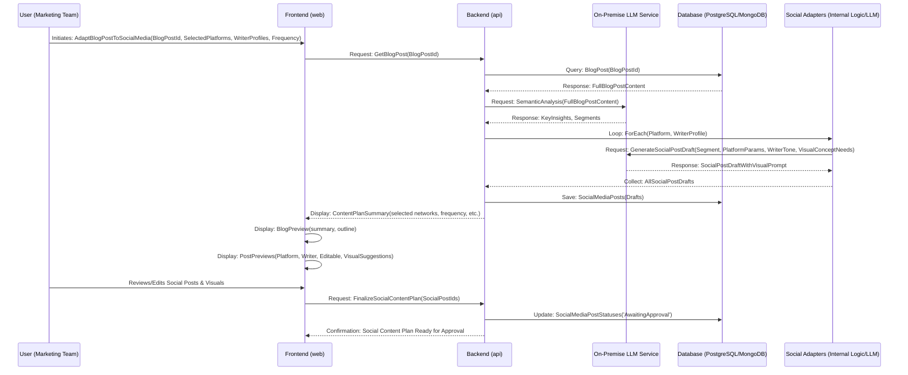

# Core Workflows

## 1\. Company Identification & Context Gathering Workflow

This diagram illustrates the process from initial user input of a company name to the system identifying and validating the most likely company, and gathering its detailed context.

*Rationale:* This workflow details the intricate dance between frontend, backend, on-premise LLM, and external data/AI for the initial and crucial step of company identification and context building. It highlights the user's role in validation.

## 2\. Annual Content Plan & Blog Post Generation Workflow

This diagram illustrates the process from selecting a topic from the annual plan to generating and reviewing a long blog post.

*Rationale:* This workflow clearly delineates the stages of content planning and blog post creation, emphasizing the iterative interaction between the user and the AI (both frontend and on-premise LLM) for outline and full content generation and approval.

## 3\. Blog Post to Social Media Adaptation & Preview Workflow

This diagram shows how a finalized blog post is transformed into platform-specific social media content and presented for user review.

*Rationale:* This workflow showcases the adaptation process, emphasizing the role of semantic analysis and multi-layered AI generation for platform- and writer-specific content, culminating in a comprehensive preview for user validation. It explicitly includes the generation of visual concepts.
