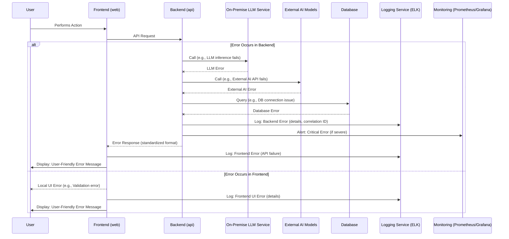

# Error Handling Strategy

## Error Flow

This sequence diagram illustrates the unified error handling flow across the frontend and backend, from an error occurring to its logging and potential user notification.



*Rationale:* This diagram depicts a centralized error handling approach where backend errors are caught, logged, monitored, and then returned to the frontend in a standardized, user-friendly format. Frontend-specific errors are also logged.

## Error Response Format

To ensure consistency, all error responses from the backend API will adhere to a standardized format.

```typescript
interface ApiError {
  error: {
    code: string;       // Unique error code (e.g., "AUTH_001", "DB_003", "LLM_GEN_FAILED")
    message: string;    // User-friendly error message
    details?: Record<string, any>; // Optional: more technical details for debugging (e.g., validation errors)
    timestamp: string;  // ISO 8601 timestamp of when the error occurred
    requestId: string;  // Unique request ID for tracing across services
  };
}
```

*Rationale:* This format provides both a user-friendly message and structured details for debugging, crucial for effective error diagnosis and resolution. `requestId` is vital for tracing distributed transactions.

## Frontend Error Handling

The frontend will implement a global error handling strategy to gracefully manage API errors and local UI issues.

```typescript
// apps/web/src/utils/errorHandler.ts (Conceptual)
import { ApiError } from '@shared/types'; // Assuming shared error interface

export const handleApiError = (error: any): void => {
  if (error.response && error.response.data && error.response.data.error) {
    const apiError: ApiError = error.response.data;
    console.error('API Error:', apiError.error);
    // Display user-friendly message based on apiError.error.message or code
    // E.g., show a toast notification, redirect to an error page
    alert(`Error: ${apiError.error.message} (Code: ${apiError.error.code})`);
  } else {
    console.error('Unexpected error:', error);
    alert('An unexpected error occurred. Please try again.');
  }
  // Log frontend error to centralized logging (e.g., Sentry, custom logging endpoint)
};

// Global error boundary for React components
// (apps/web/src/components/ErrorBoundary/ErrorBoundary.tsx)
// Catches errors in React component tree and displays fallback UI
```

*Rationale:* Centralizing API error handling ensures consistent user feedback and logging. Global error boundaries prevent UI crashes from unhandled component errors.

## Backend Error Handling

The backend will implement a robust error handling middleware or interceptors to catch, process, and log errors, and return standardized responses.

```typescript
// apps/api/src/common/filters/all-exceptions.filter.ts (NestJS Example)
import { ExceptionFilter, Catch, ArgumentsHost, HttpException, HttpStatus } from '@nestjs/common';
import { Request, Response } from 'express';
import { v4 as uuidv4 } from 'uuid'; // For request ID

@Catch()
export class AllExceptionsFilter implements ExceptionFilter {
  catch(exception: unknown, host: ArgumentsHost) {
    const ctx = host.switchToHttp();
    const response = ctx.getResponse<Response>();
    const request = ctx.getRequest<Request>();
    const requestId = request.headers['x-request-id'] || uuidv4(); // Use existing or generate new

    let status = HttpStatus.INTERNAL_SERVER_ERROR;
    let message = 'Internal server error';
    let code = 'SERVER_ERROR_001';
    let details: Record<string, any> | undefined = undefined;

    if (exception instanceof HttpException) {
      status = exception.getStatus();
      const exceptionResponse = exception.getResponse();
      if (typeof exceptionResponse === 'string') {
        message = exceptionResponse;
      } else if (typeof exceptionResponse === 'object' && exceptionResponse !== null) {
        // NestJS validation pipe errors usually have 'message' array
        if (Array.isArray((exceptionResponse as any).message)) {
          message = (exceptionResponse as any).message.join(', ');
          code = 'VALIDATION_ERROR';
          details = { validationErrors: (exceptionResponse as any).message };
        } else {
          message = (exceptionResponse as any).message || message;
          code = (exceptionResponse as any).code || code; // Custom error code
        }
      }
    } else if (exception instanceof Error) {
      message = exception.message;
      // You can implement custom error types and map them to codes
    }

    // Log the error to ELK/CloudWatch
    console.error(`[${requestId}] - ${request.method} ${request.url} - Status: ${status} - Code: ${code} - Message: ${message}`, {
      stack: (exception instanceof Error) ? exception.stack : undefined,
      details: details,
      user: (request as any).user ? (request as any).user.id : 'anonymous',
      // Add more context like LLM/External AI specific errors if available
    });

    response.status(status).json({
      error: {
        code,
        message,
        details, // Include details only in dev/staging or for specific error types
        timestamp: new Date().toISOString(),
        requestId,
      },
    });
  }
}
```

*Rationale:* A global exception filter in NestJS catches all unhandled errors, logs them with context (including a `requestId` for tracing), and transforms them into the standardized `ApiError` format before sending back to the client. This ensures sensitive stack traces are not exposed in production and provides consistent error payloads.
