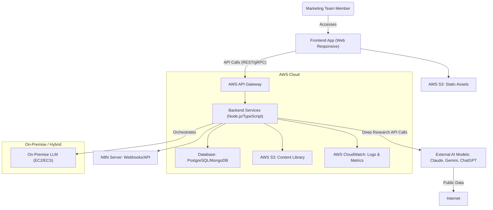

# High Level Architecture

## Technical Summary

The system will leverage a hybrid service architecture, combining a monolithic approach for the core on-premise LLM and content generation with microservices/serverless functions for external AI integrations and ancillary services. It will utilize a monorepo structure to streamline full-stack development. The architecture prioritizes scalability, security, and maintainability, ensuring efficient content generation and seamless integration with various social media platforms and external tools.

## Platform and Infrastructure Choice (Revised)

Based on the clarification that you have **your own servers on Hetzner**, we will pivot the infrastructure strategy to leverage this existing resource. This offers benefits in terms of cost control and direct control over hardware, aligning with the on-premise LLM requirement.

* **Provider:** Hetzner (Self-Managed / Bare Metal / Cloud Servers)
* **Key Services:**
    * **Virtual Machines / Bare Metal Servers:** For hosting the core on-premise LLM, backend services (Node.js/TypeScript), and the database.
    * **Containerization (e.g., Docker/Kubernetes):** Highly recommended for deploying backend services and potentially the LLM for efficient resource management, scalability, and easier deployment/orchestration on Hetzner servers.
    * **Object Storage (e.g., Hetzner Storage Box or S3-compatible service):** For the content library (generated blog posts, social posts, visuals).
    * **Load Balancer (e.g., Hetzner Load Balancer or Nginx/HAProxy):** For distributing traffic to backend services and ensuring high availability.
    * **Managed Database (if available/desired from Hetzner) or Self-Hosted Database:** For the primary database.
    * **Monitoring & Logging (e.g., Prometheus/Grafana stack, ELK stack):** For observability of all services and the LLM.
    * **VPN/Secure Tunnel:** For secure connectivity between your internal network (where users might be, or your N8N server) and the Hetzner servers if needed, or secure access for management.
* **Deployment Host and Regions:** Given your current location in Cheb, Karlovy Vary Region, Czechia, a Hetzner data center in a nearby region would be ideal for minimizing latency. Hetzner offers locations in **Germany (e.g., Falkenstein, Nuremberg, Helsinki)**. We can select the most appropriate one based on your specific server allocation and network considerations.

*Rationale for Change:* Leveraging existing Hetzner infrastructure provides significant advantages by utilizing current investments and offering full control over the environment, which is particularly beneficial for managing the on-premise LLM. Containerization will ensure the scalability and manageability typically found in cloud environments, adapted to your self-managed setup.

## Repository Structure

**Structure: Monorepo**
**Monorepo Tool:** Nx (recommended for its robust tooling for full-stack monorepos, including code generation, task running, and shared library management).
**Package Organization:** We will organize the monorepo into distinct `apps/` (for the frontend and backend applications) and `packages/` (for shared types, utilities, and potentially shared UI components).

## High Level Architecture Diagram

*Rationale:* This diagram visualizes the primary components and data flows. The user interacts with the frontend, which communicates with the backend via API Gateway. The backend orchestrates calls to the on-premise LLM for content generation and external AIs for deep research. All data is persisted in the database and S3, with logs pushed to CloudWatch. N8N integration is shown for external automation.

## Architectural and Design Patterns

  * **Serverless Architecture (for Ancillary Services/External Integrations):** Using AWS Lambda for compute.
      * *Rationale:* Aligns with the need for flexibility and scalability for services that interact with external APIs, without incurring always-on costs.
  * **Repository Pattern (for Data Access):** Abstract data access logic.
      * *Rationale:* Enables testing and future database migration flexibility, decoupling business logic from database specifics.
  * **API Gateway Pattern (for Unified API Access):** Single entry point for all API calls.
      * *Rationale:* Centralizes authentication, rate limiting, and monitoring for both internal and external API consumers.
  * **Component-Based UI (for Frontend):** Reusable React components with TypeScript.
      * *Rationale:* Promotes maintainability and type safety across large codebases, supporting modular UI development.
  * **Microservices (for External AI Integrations & Ancillary Services):**
      * *Rationale:* Supports independent development, deployment, and scaling of services that interact with external APIs, limiting the blast radius of changes to specific integrations. This also helps with data privacy for external calls.
  * **Monolith (for Core On-Premise LLM & Content Generation):**
      * *Rationale:* For the core LLM and tightly coupled content generation logic, a monolithic approach can simplify management, ensure performance, and maintain control over the proprietary aspects of the application.
